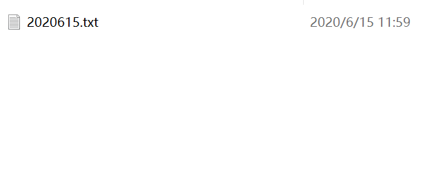
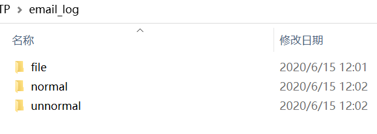
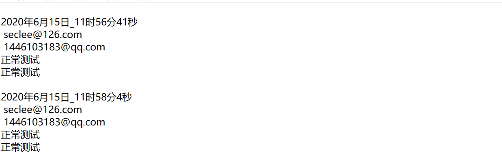
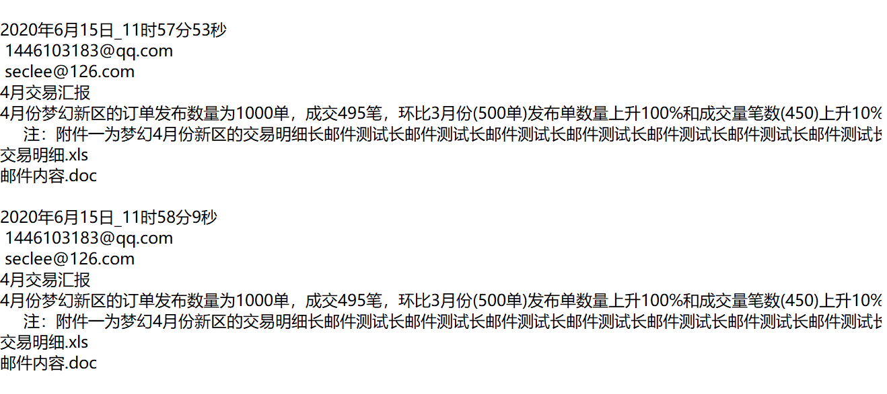

### SMTP敏感邮件过滤应用
处理的是smtp数据包，所以应该运行在本地的邮件服务器，真实场景用来处理邮件服务器流过的SMTP包。

##### 功能实现
实现了对SMTP报文的抓包，数据包合并，邮件内容以及附件提取，邮件内容敏感字检测。

##### 文件目录说明

./sniff_async.py 执行脚本

./normal_smtpsender.py 正常邮件发送模拟脚本

./unnormal_smtpsender.py 问题邮件发送模拟脚本

./交易明细.xls，./邮件内容.doc : 模拟附件

./setting/keywords.txt 关键字词库

./email_log/file/ 存放解析的附件文件

./email_log/normal/ 存放正常邮件日志，需要把对应的解析代码取消注释

./email_log/unnormal/ 存放问题邮件的截获信息

##### 环境要求
window下需要安装 npacp （抓包）

python环境，py3.6+

依赖包 scapy

```pip install -r requirement.txt```

##### 运行
```python sniff_async.py```

**模拟邮件发送**
需要在邮件发送脚本配置好邮箱信息

部分邮箱需要用授权码登录

##### 目录示例
<div align="center">
  
</div>
<div align="center">
  
</div>
<div align="center">
  
</div>
<div align="center">
  
</div>
